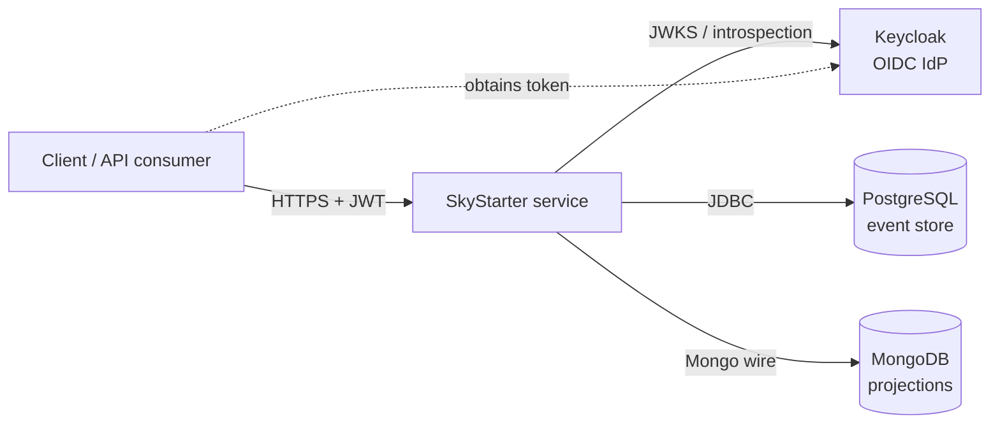

# Business context

External actors and the boundaries of SkyStarter.

```mermaid
flowchart LR
    client[Client / API consumer]
    kc[Keycloak<br/>OIDC IdP]
    sky[SkyStarter service]
    pg[(PostgreSQL<br/>event store)]
    mongo[(MongoDB<br/>projections)]

    client -- HTTPS + JWT --> sky
    sky -- JWKS / introspection --> kc
    client -. obtains token .-> kc
    sky -- JDBC --> pg
    sky -- Mongo wire --> mongo
```
