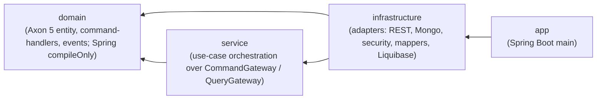

# Module dependencies

Strict inward-only dependency rule between Gradle modules.

The arrow direction is the *only* allowed direction. A new dependency the other way (e.g. `domain → infrastructure`) is a build-breaking violation of the architecture.

> Note on `domain` and Spring: the `domain` module has a narrow `compileOnly` dependency on `spring-context` so the `SkyAggregate` can wear the `@EventSourced` Spring stereotype that Axon 5's lookup requires. No Spring runtime classes leak into the domain. See [ADR-0010](../decisions/0010-upgrade-to-axon-5.md) for the deliberate deviation from ADR-0001.
