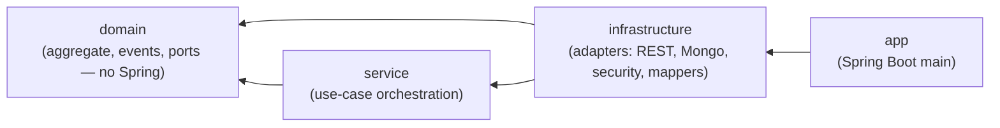

# Module dependencies

Strict inward-only dependency rule between Gradle modules.

The arrow direction is the *only* allowed direction. A new dependency the other way (e.g. `domain → infrastructure`) is a build-breaking violation of the architecture.
