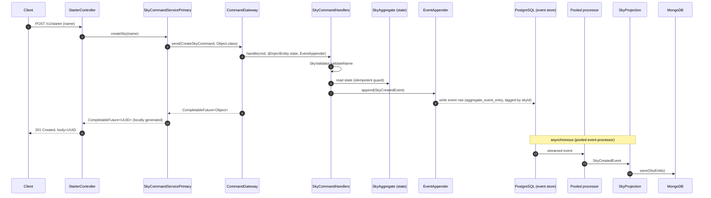

# Create-Sky — sequence

End-to-end write path under the Axon 5 entity model, including async projection update.

```mermaid
sequenceDiagram
    autonumber
    participant C as Client
    participant Ctrl as StarterController
    participant CmdSvc as SkyCommandServicePrimary
    participant CmdGW as CommandGateway
    participant Hdl as SkyCommandHandlers
    participant State as SkyAggregate (state)
    participant App as EventAppender
    participant PG as PostgreSQL (event store)
    participant TP as Pooled processor
    participant Proj as SkyProjection
    participant Mongo as MongoDB

    C->>Ctrl: POST /v1/starter {name}
    Ctrl->>CmdSvc: createSky(name)
    CmdSvc->>CmdGW: send(CreateSkyCommand, Object.class)
    CmdGW->>Hdl: handle(cmd, @InjectEntity state, EventAppender)
    Hdl->>Hdl: SkyValidator.validateName
    Hdl->>State: read state (idempotent guard)
    Hdl->>App: append(SkyCreatedEvent)
    App-->>PG: write event row (aggregate_event_entry, tagged by skyId)
    CmdGW-->>CmdSvc: CompletableFuture<Object>
    CmdSvc-->>Ctrl: CompletableFuture<UUID> (locally generated)
    Ctrl-->>C: 201 Created, body=UUID
    Note over PG,Proj: asynchronous (pooled event processor)
    PG->>TP: streamed event
    TP->>Proj: SkyCreatedEvent
    Proj->>Mongo: save(SkyEntity)
```
