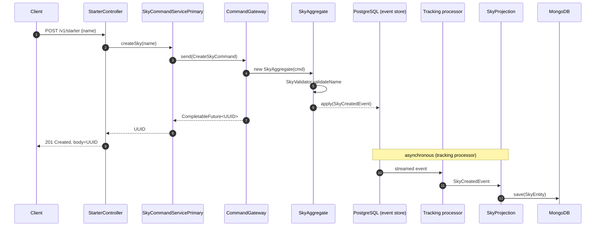

# Create-Sky — sequence

End-to-end write path including async projection update.

```mermaid
sequenceDiagram
    autonumber
    participant C as Client
    participant Ctrl as StarterController
    participant CmdSvc as SkyCommandServicePrimary
    participant CmdGW as CommandGateway
    participant Agg as SkyAggregate
    participant PG as PostgreSQL (event store)
    participant TP as Tracking processor
    participant Proj as SkyProjection
    participant Mongo as MongoDB

    C->>Ctrl: POST /v1/starter {name}
    Ctrl->>CmdSvc: createSky(name)
    CmdSvc->>CmdGW: send(CreateSkyCommand)
    CmdGW->>Agg: new SkyAggregate(cmd)
    Agg->>Agg: SkyValidator.validateName
    Agg-->>PG: apply(SkyCreatedEvent)
    CmdGW-->>CmdSvc: CompletableFuture<UUID>
    CmdSvc-->>Ctrl: UUID
    Ctrl-->>C: 201 Created, body=UUID
    Note over PG,Proj: asynchronous (tracking processor)
    PG->>TP: streamed event
    TP->>Proj: SkyCreatedEvent
    Proj->>Mongo: save(SkyEntity)
```
