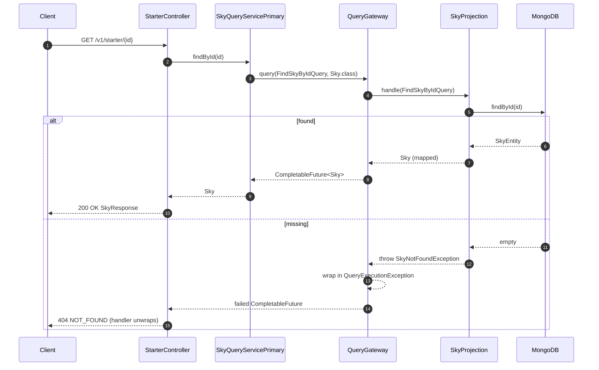

# Get-Sky — sequence

Read path. Note: served from the MongoDB projection, not from event replay.

```mermaid
sequenceDiagram
    autonumber
    participant C as Client
    participant Ctrl as StarterController
    participant QrySvc as SkyQueryServicePrimary
    participant QryGW as QueryGateway
    participant Proj as SkyProjection
    participant Mongo as MongoDB

    C->>Ctrl: GET /v1/starter/{id}
    Ctrl->>QrySvc: findById(id)
    QrySvc->>QryGW: query(FindSkyByIdQuery, Sky.class)
    QryGW->>Proj: handle(FindSkyByIdQuery)
    Proj->>Mongo: findById(id)
    alt found
        Mongo-->>Proj: SkyEntity
        Proj-->>QryGW: Sky (mapped)
        QryGW-->>QrySvc: CompletableFuture<Sky>
        QrySvc-->>Ctrl: Sky
        Ctrl-->>C: 200 OK SkyResponse
    else missing
        Mongo-->>Proj: empty
        Proj-->>QryGW: throw SkyNotFoundException
        QryGW-->>QryGW: wrap in QueryExecutionException
        QryGW-->>Ctrl: failed CompletableFuture
        Ctrl-->>C: 404 NOT_FOUND (handler unwraps)
    end
```
