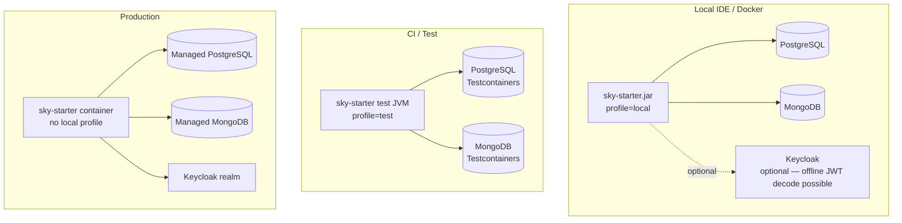

# Deployment view

Per-environment topology.

```mermaid
flowchart TB
    subgraph local[Local IDE / Docker]
        l_app[sky-starter.jar<br/>profile=local]
        l_pg[(PostgreSQL)]
        l_mongo[(MongoDB)]
        l_kc[Keycloak<br/>optional — offline JWT decode possible]
    end

    subgraph ci[CI / Test]
        t_app[sky-starter test JVM<br/>profile=test]
        t_pg[(PostgreSQL<br/>Testcontainers)]
        t_mongo[(MongoDB<br/>Testcontainers)]
    end

    subgraph prod[Production]
        p_app[sky-starter container<br/>no local profile]
        p_pg[(Managed PostgreSQL)]
        p_mongo[(Managed MongoDB)]
        p_kc[Keycloak realm]
    end

    l_app --> l_pg
    l_app --> l_mongo
    l_app -. optional .-> l_kc

    t_app --> t_pg
    t_app --> t_mongo

    p_app --> p_pg
    p_app --> p_mongo
    p_app --> p_kc
```
